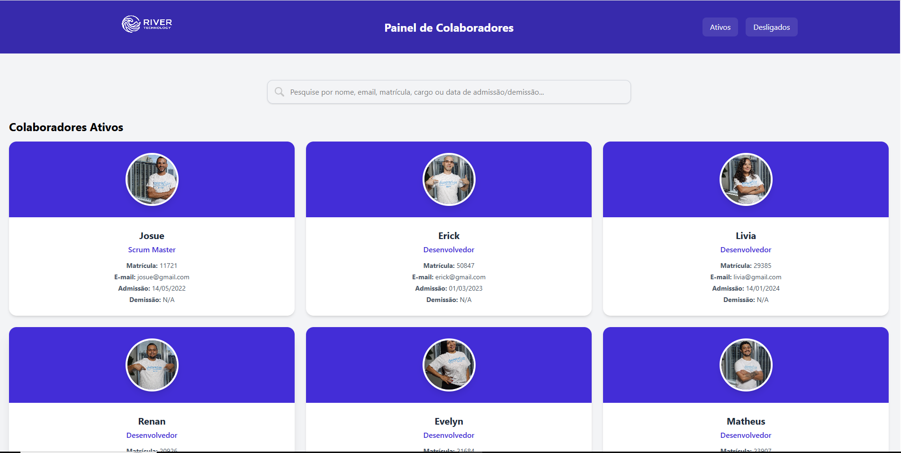

River RH - Frontend
  
  

  

1. Descrição

O River RH é uma aplicação frontend desenvolvida em React para gerenciamento e visualização de colaboradores de uma empresa.

A aplicação permite pesquisar colaboradores por diversos campos, filtrar por status (ativos ou desligados) e visualizar informações detalhadas como matrícula, cargo, datas de admissão e demissão.

O projeto foi construído com foco em componentização, tipagem com TypeScript e estilização moderna com TailwindCSS.

2. Recursos

Principais funcionalidades implementadas:

🔎 Busca dinâmica por colaboradores

Nome 
Email 
Matrícula 
Cargo 
Status (ativo/demitido) 
Datas de admissão e demissão 

👥 Listagem de colaboradores ativos na Home por padrão 

🚫 Filtro de colaboradores desligados através da Navbar 

🔄 Reset automático da Home ao limpar busca 

🧩 Arquitetura organizada em: 

Components 

Pages 

Services 

Data 

🎨 Interface moderna com TailwindCSS

3. Captura da Tela Principal

  

4. Tecnologias 

Item	        Descrição 
Servidor	    Node.js 
Linguagem	    TypeScript 
Biblioteca	  React 
Build Tool	  Vite 
Estilização	  TailwindCSS 
Roteamento	  React Router DOM 

5. Pré-requisitos

Antes de iniciar, instale:

Node.js (v16 ou superior)
npm ou yarn

6. Configuração e Execução
1️⃣ Clone o repositório
git clone <url-do-repositorio>

2️⃣ Entre na pasta do projeto
cd rh_02_react

3️⃣ Instale as dependências
npm install

4️⃣ Execute o projeto
npm run dev

5️⃣ Acesse no navegador
http://localhost:5173

7. Estrutura do Projeto

src/ 
│
├── components/ 
│   ├── Cards/           # Card de colaborador 
│   ├── CampoDeBusca/    # Barra de busca 
│   └── Navbar/          # Filtro de status 
│
├── data/ 
│   └── Data.ts          # Base mockada de colaboradores 
│
├── pages/
│   └── home/            # Página principal 
│
├── services/
│   └── Services.ts      # Regras de negócio e filtros 
│
├── App.tsx              # Rotas e estado global da Home 
└── main.tsx             # Entrada da aplicação 

8. Regras de Negócio

✔️ A Home inicia mostrando apenas colaboradores ativos 
✔️ Colaboradores desligados aparecem somente quando: 

Pesquisados na busca 
Filtrados pelo botão Desligados 

9. Como Contribuir 
Faça um fork do projeto 
Crie uma branch 
git checkout -b minha-feature 
Commit suas mudanças 
git commit -m "Nova feature" 
Push 
git push origin minha-feature 
Abra um Pull Request 🚀 
